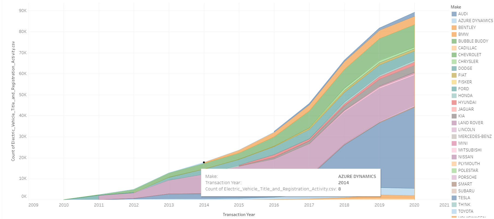
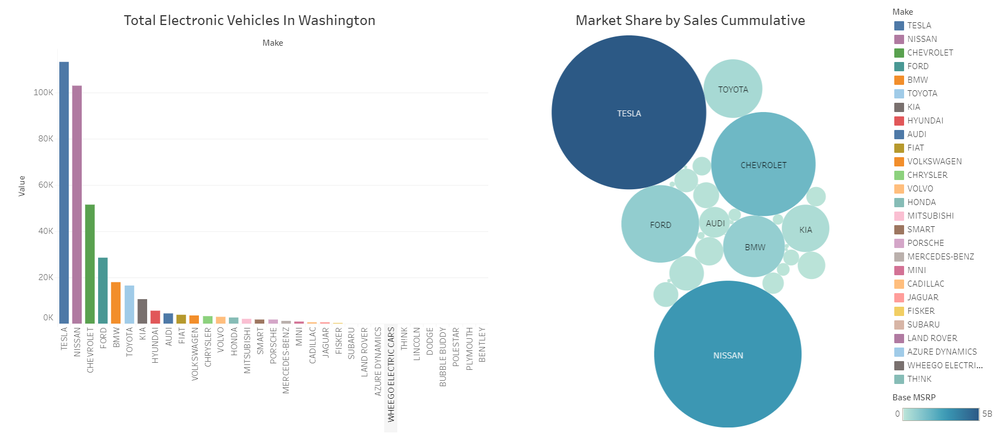
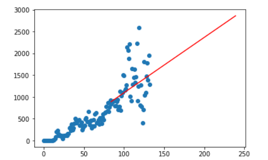

# EV-Adoption-Prediction
A project to predict the adoption of Electric Vehicle registrations in different US regions.  Business problem is represented in this [Tableau Data Story](https://public.tableau.com/profile/sonny5205#!/vizhome/Project-3_16180781413350/Story1?publish=yes).

We started our project with the idea of predicting the adoption rate of Electric Vehicles in different parts of the US. With limited access to all the necessary data we decided to use the data we were able to find to narrow our scope to a metroplitan area (Seattle, Washington) instead of the entiriety of the US.  

The WA dataset shows significant growth in the number of Electric Vehicles titled over the past 10 years.  

The biggest market share of Electric Vehicles in WA State is owned by Tesla, with many manufacturers increasing market share in recent years.  

We used a **Linear Regression Machine Learning Engine** to predict the trend in Electric Vehicle titles issued over the next 10 years.  

## The frameworks we used to build this project are as follows:

Python Pandas  
Tableau  
Machine Learning: Linear Regression

## Data Sources:

Alternative Fuels Data Center
https://afdc.energy.gov/stations/states

Washington State Electric Vehicle Registration Activity Data
https://catalog.data.gov/dataset/electric-vehicle-title-and-registration-activity

Census API Data 
Collected in Data folder for future regression analysis

## Getting started

Prerequisite
Specific softwares needed to install:  
Pandas  
Scikit  
Tableau  
API  
Numpy  
Matplotlib  

Clone the repo  
git clone git@github.com:jennneth/EV-Adoption-Prediction.git

Original Project collaboration with:  
Sonny Maz  
Alvin McCray  
Arthur An  
JB Kinlacheeny  
Jen Johansson
